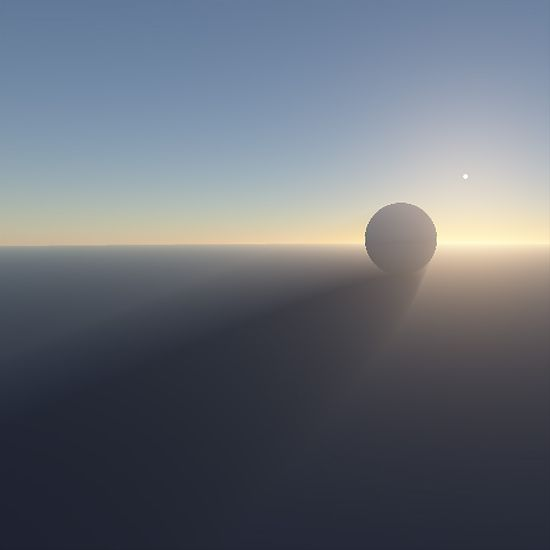
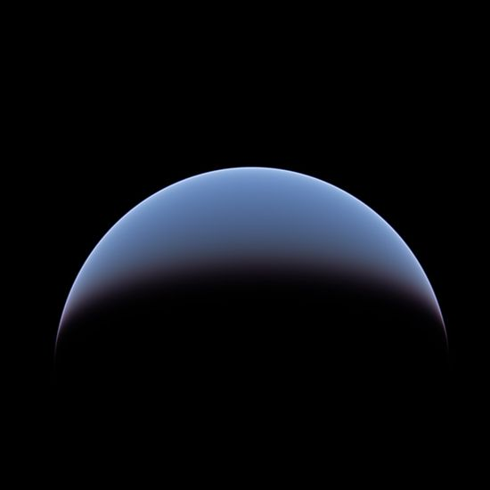
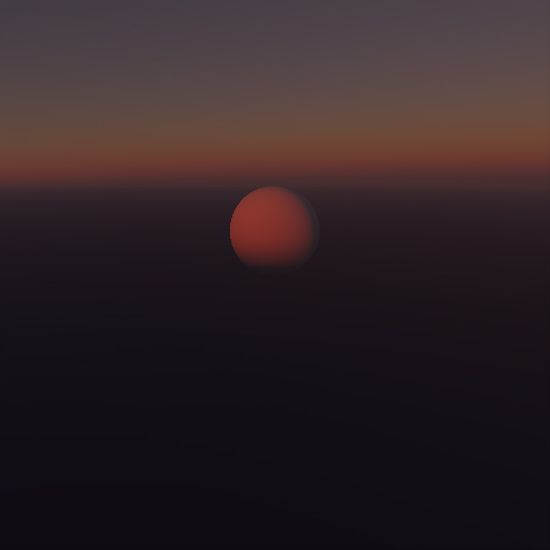
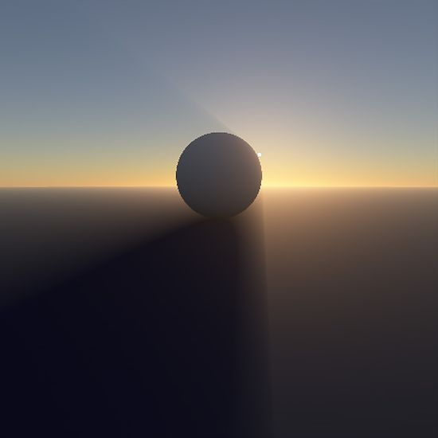
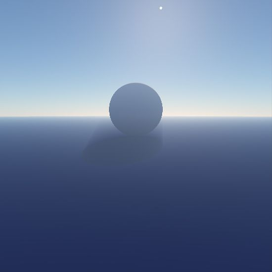

# Brunetons-Improved-Atmospheric-Scattering

This is a port to Unity of a updated and improved version of [Brunetons atmospheric scatter](https://github.com/ebruneton/precomputed_atmospheric_scattering) published in 2017. The [original](https://www.digital-dust.com/single-post/2017/03/24/Brunetons-atmospheric-scattering-in-Unity) was published in  2008 so is a bit old now.

The new version contains the follow improvements.

* More descriptive function and variable names and extensive comments.

* Improved texture coordinate mapping which removes the horizon artifact in the previous version.

* Provides a option to store the single Mie scatter in the alpha channel (Rayleigh is in the rgb) or in the rgb of a separate   texture.

* Provides a example of how to combine with light shafts.

* Converts the spectral radiance values to RGB luminance values as described in [A Qualitative and Quantitative Evaluation of 8 Clear Sky Models](https://arxiv.org/pdf/1612.04336.pdf) (section 14.3)

* Or precomputes luminance values instead of spectral radiance values, as described in [Real-time Spectral Scattering in Large-scale Natural Participating Media](http://www.oskee.wz.cz/stranka/uploads/SCCG10ElekKmoch.pdf) (section 4.4). The precomputation phase is then slower than with the above option, but uses the same amount of GPU memory.

* Adds support for the ozone layer, and for custom density profiles for air molecules and aerosols.

The demo uses a image effect shader as a example of how to use the scattering. The sphere rendered and its light shafts are hard coded into the shader as its just a example. Some work would be needed to convert this into a practical implementation

